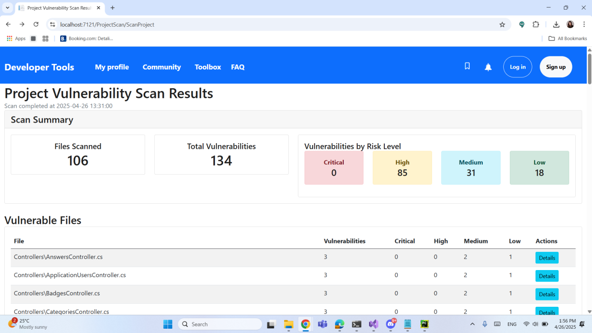

# Raport: Concepte și metode din articolul  
**„TestLab: An Intelligent Automated Software Testing Framework” [1]**

**Autori:**  
Stoinea Maria Miruna  
Nazare Elena-Denisa  
Ciurescu Irina Alexandra  
Antonescu Ionut-Andrei

---

## 1. Introducere / Context

Deoarece sistemele software sunt peste tot, ele nu mai sunt doar opționale sau de nișă, ci parte fundamentală a vieții de zi cu zi. Astfel, aplicațiile au devenit din ce în ce mai mari și mai complicate. Nu mai e vorba de aplicații simple, ci de sisteme complexe, cu sute de mii de linii de cod și componente interconectate. Această complexitate are un cost: durează mai mult să proiectezi, implementezi, testezi și întreții software. [2]

Articolul abordează problema calității scăzute a software-ului, cauzată adesea de testarea insuficientă sau inexistentă, din dorința de a accelera ciclul de dezvoltare. În acest context, este propus **TestLab**, un cadru inteligent pentru testarea automată a software-ului, care îmbină diverse metode de testare cu tehnici de Inteligență Artificială (IA) pentru a asigura testarea continuă și eficientă a aplicațiilor software.

TestLab este gândit să funcționeze pe toată durata dezvoltării software:
- **Dezvoltatori**: verifică codul sursă.
- **Testeri**: generează cazuri de test.
- **Utilizatori finali**: validează comportamentul aplicației.

Și face asta la toate nivelurile:
- unitate
- integrare
- sistem
- acceptanță

Este împărțit în 3 componente specializate, fiecare cu un rol: descoperă vulnerabilități în API-uri (**FuzzTheREST**), analizează codul pentru riscuri (**VulnRISKatcher**), generează automat teste (**CodeAssert**).

---

## 2. Concepte-cheie

Autorii subliniază cele două obiective fundamentale ale testării:
- **Validare**: sistemul construit răspunde cerințelor utilizatorului? (realizată de utilizatori și client)
- **Verificare**: implementarea respectă specificațiile și regulile? (realizată de o echipă tehnică)

### Testarea automată a software-ului:
Executarea testelor fără intervenție umană, cu scopul de a identifica erori și vulnerabilități în mod rapid și eficient.

### Testarea pe mai multe niveluri:
- **Unit testing** – pe componente izolate  
- **Integration testing** – interacțiunea dintre module  
- **System testing** – testarea întregului sistem  
- **Acceptance testing** – validare de către utilizatori

### Tipuri de testare:
- **White-box**: Analizează logica internă a codului.
- **Black-box**: Testează funcționalitatea fără a cunoaște implementarea internă.
- **Grey-box**: Combină abordările de mai sus.

### Inteligență Artificială în testare:
Utilizarea tehnicilor de machine learning și reinforcement learning pentru generarea automată de cazuri de test și detectarea vulnerabilităților.

După compararea unor framework-uri populare, autorii au concluzionat că nu există o soluție completă care să acopere toate tipurile de testare (black, white, grey), toate nivelurile (unit, integration, system, acceptance) și să integreze totul într-un singur cadru automatizat — de aici necesitatea și originalitatea TestLab. [3]

---

## 3. Structura și modulele TestLab

TestLab este compus din trei module principale:

### a. FuzzTheREST
- Fuzzer inteligent pentru API-uri REST, bazat pe Reinforcement Learning
- Funcționează în mod **black-box**, generând input-uri deformate și folosind feedback-ul API-ului
- Poate fi extins la **grey-box** prin analiza execuției codului

### b. VulnRISKatcher
- Detectează vulnerabilități în codul sursă, folosind modele de **machine learning**
- Suportă mai multe limbaje și funcționează pe fragmente de cod

### c. CodeAssert
- Automatizează generarea de scripturi de test folosind **analiza codului** și **NLP**
- Asigură acoperire de 100% pentru **testare unitară și de integrare** (white-box)

---

## 4. Exemplu practic

### a. Aplicația: Developer Toolbox

**Descriere:**  
Platformă interactivă pentru învățarea și exersarea programării. Utilizatorii pot adresa întrebări, rezolva exerciții, urmări progresul și participa la provocări săptămânale.

**Funcționalități principale:**
- Întrebări și răspunsuri tehnice
- Exerciții de programare cu editor integrat
- Puncte de reputație, medalii, clasamente
- Provocări săptămânale
- Administrare și moderare

**Beneficii:**
- Începătorii pot învăța și primi ajutor
- Utilizatorii avansați pot contribui și rezolva exerciții complexe
- Platforma încurajează competiția și învățarea continuă

**Tehnologii utilizate:**
- **ASP.NET Core, C#** – aplicație web
- **Entity Framework Core, LINQ** – gestionarea datelor
- **SQL Server** – stocarea datelor
- **JavaScript, HTML, CSS** – interfață
- **Python** – server backend și compilator

**Scopuri pentru testare:**  
Validarea funcționalităților aplicației: logare, gestionare întrebări/răspunsuri, exerciții, recompense.

---

### b. Implementarea primului modul: FuzzTheREST

**RESTler** [4] – un instrument de fuzzing pentru API-uri REST.

**Caracteristici:**
- Instrument „stateful”, analizează comportamentul anterior al aplicației
- Folosește **Reinforcement Learning** pentru generarea input-urilor
- Evită inputurile invalide, optimizează procesul de testare
- Poate integra analiza execuției pentru **grey-box testing**

**Cum funcționează RESTler:**
1. **Input de la tester**: fișier OpenAPI, scenarii, parametri RL
2. **Generare input-uri**: bazată pe feedback-ul de la API
3. **Evaluarea vulnerabilităților**: detectează erori/vulnerabilități și ajustează căutarea
4. **Raport final**: vulnerabilități descoperite, input-uri testate, metrice de acoperire

RESTler eficientizează testarea automată a API-urilor REST și poate identifica vulnerabilități greu de descoperit manual.

---

## c. Implementarea celui de-al doilea modul -- VulnRISKatcher

Așa cum reiese din articol, **VulnRISKatcher** este un instrument inovator pentru identificarea și clasificarea vulnerabilităților în codul sursă, utilizând tehnici avansate de Machine Learning. Spre deosebire de instrumentele tradiționale de revizuire a codului care folosesc abordări statice, VulnRISKatcher oferă o alternativă mai eficientă care nu necesită înțelegerea completă a contextului codului.

### Caracteristici principale:

1. **Utilizarea tehnicilor ML pentru verificarea codului** - Permite analiza codului fără a necesita contextul complet, făcând instrumentul aplicabil la diferite niveluri de testare.

2. **Suport pentru diverse limbaje de programare** - Instrumentul analizează cod lexical din multiple limbaje de programare, crescând versatilitatea soluției.

3. **Pipeline de procesare structurat** - Procesul include:
   - Furnizarea codului și specificarea limbajului de programare
   - Preprocesarea datelor (curățarea și divizarea în unități discrete)
   - Analiza pentru identificarea tiparelor asociate vulnerabilităților
   - Clasificarea vulnerabilităților identificate
   - Generarea unui raport detaliat pentru utilizator

4. **Identificarea și clasificarea riscurilor** - Pe lângă detectarea vulnerabilităților, instrumentul evaluează și riscurile asociate acestora.

VulnRISKatcher reprezintă un pas important în evoluția instrumentelor de testare software, oferind o soluție mai rapidă și mai precisă pentru identificarea vulnerabilităților, contribuind astfel la îmbunătățirea calității software-ului și la reducerea costurilor de dezvoltare și mentenanță.

### Proof of concept

Pentru a ne apropia în practică de conceptul teoretic de VulnRISKatcher am decis să încercăm să folosim un model de Machine Learning, întrucât învățarea automată este una dintre caracteristicile care stau la baza conceptului.

Am ales să folosim modele de pe HuggingFace și astfel am găsit modelul *microsoft/codebert-base*, care însă ar fi avut nevoie de fine-tuning, așa că am încercat să găsim un model deja fine-tunat. Acest lucru s-a dovedit a fi un task destul de complicat, dar în urma căutărilor am ajuns la două variante:

1. *mahdin70/CodeBERT-VulnCWE* - antrenat pe un set de date curatoriat și îmbogățit pentru detectarea vulnerabilităților și clasificarea CWE. Modelul poate prezice dacă un fragment de cod este vulnerabil și, în caz afirmativ, poate identifica ID-ul CWE specific asociat. (părea o variantă promițătoare, dar am avut probleme cu importarea acestuia, deci am fost nevoiți să renunțăm)

2. *mrm8488/codebert-base-finetuned-detect-insecure-code* - Modelul analizează secvențe de cod sursă pentru a determina dacă acestea conțin vulnerabilități de securitate (precum scurgeri de resurse sau atacuri DoS), clasificându-le binar ca sigure (0) sau nesigure (1). (deși ne oferă doar o clasificare binară a erorilor, acest model s-a dovedit a fi o variantă mai sigură și cu care am reușit să lucrăm)

Deși modelul oferă doar o clasificare binară (cod sigur vs. cod nesigur), l-am integrat într-o analiză mai nuanțată. Pentru a face analiza mai detaliată, am implementat:

- Analiza globală a codului pentru o evaluare generală a întregului fișier
- Analiza pe secțiuni consecutive de cod (denumită "ferestre glisante" sau "sliding windows") - aceasta împarte codul în bucăți mai mici de câte 15 linii, care se suprapun parțial (cu 5 linii), pentru a identifica mai precis zonele problematice din cod

Tot pentru a compensa limitarea clasificării binare a modelului ML, am implementat și un sistem extins de reguli bazat pe expresii regulate, care poate identifica zece categorii specifice de vulnerabilități:

#### SQL Injection
Detectează construirea nesigură a interogărilor SQL prin concatenare de șiruri

```python
"patterns": [
    r"string\s+sql\s*=.*\+",
    r"executeQuery\(.*\+",
    # ... alte modele
]
```

### Cross-Site Scripting (XSS) - Identifică manipularea nesigură a DOM-ului și execuția de cod dinamic 
```python
"patterns": [
    r"innerHTML\s*=",
    r"document\.write\(",
    # ... alte modele
]
```

### Probleme de autentificare - Găsește credențiale hardcodate și configurări nesigure de autentificare 
```python
"patterns": [
    r"password\s*=\s*\"[^\"]+\"",
    r"hardcoded.*password",
    # ... alte modele
]
```

### Bypass-uri de autorizare - Detectează modificări nesigure ale rolurilor și permisiunilor
```python
"patterns": [
    r"\.Authorize\(.*false\)",
    r"isAdmin\s*=\s*true",
    # ... alte modele
]
```

### Referințe directe nesigure la obiecte - Identifică accesarea directă a obiectelor fără verificare
```python
"patterns": [
    r"Request\.QueryString\[\"id\"\]",
    r"Request\.Params\[\"id\"\]",
    # ... alte modele
]
```

### Configurări greșite de securitate - Găsește setări de debug active sau configurări HTTPS/SSL dezactivate
```python
"patterns": [
    r"debug\s*=\s*true",
    r"IsDebug\s*=\s*true",
    # ... alte modele
]
```

### Expunere de date sensibile - Detectează utilizarea algoritmilor criptografici slabi sau manipularea datelor sensibile
```python
"patterns": [
    r"\.CreateEncryptor\(",
    r"MD5\.",
    # ... alte modele
]
```

### Lipsă control acces la nivel de funcție - Identifică potențiale probleme în verificarea accesului
```python
"patterns": [
    r"\.IsAdmin\(\)",
    r"UserManager\.",
    # ... alte modele
]
```

### Cross-Site Request Forgery (CSRF) - Găsește endpoint-uri vulnerabile la CSRF
```python
"patterns": [
    r"\[HttpPost\](?!.*(?:\[ValidateAntiForgeryToken\]|\[AutoValidateAntiforgeryToken\]))",
    # ... alte modele
]
```

### Utilizarea componentelor cu vulnerabilități cunoscute - Detectează versiuni vechi și vulnerabile ale bibliotecilor comune
```python
"patterns": [
    r"jQuery.{0,10}[\"']1\.[0-9]\.[0-9][\"']",
    r"bootstrap.{0,10}[\"']2\.[0-9]\.[0-9][\"']",
    # ... alte modele
]
```

Fiecare vulnerabilitate este evaluată pe o scară de risc cu 5 niveluri:
RISK_LEVELS = {
    0: "Sigur",
    1: "Scăzut",
    2: "Mediu",
    3: "Ridicat",
    4: "Critic"
}

### Integrarea API-ului Flask cu aplicația .NET

API-ul de analiză a vulnerabilităților a fost implementat ca un serviciu independent în Flask, care comunică cu aplicația principală .NET prin intermediul cererilor HTTP. Această arhitectură cu microservicii oferă flexibilitate și permite evoluția independentă a celor două componente.

API-ul Flask oferă un endpoint REST *(/analyze)* care:
- Primește cod sursă și (opțional) limbajul de programare
- Aplică analiza bazată pe reguli
- Aplică analiza bazată pe ML (dacă modelul este disponibil)
- Combină rezultatele, eliminând duplicatele și ajustând nivelurile de încredere
- Generează un raport detaliat cu vulnerabilitățile identificate, nivelurile de risc și recomandări pentru remediere

### Structura aplicației .NET pentru scanarea de vulnerabilități
```python
Pentru a integra API-ul Flask în aplicația .NET, am implementat o structură modulară cu următoarele componente principale:
├── Controllers/
│   ├── ProjectScanController.cs
│
├── Services/
│   ├── Vulnerability/
│   │   ├── IVulnerabilityService.cs
│   │   ├── VulnerabilityService.cs
│   │   ├── VulnerabilityAnalysisResult.cs
│   │
│   ├── CodeScanner/
│       ├── ICodeScannerService.cs
│       ├── CodeScannerService.cs
│       ├── FileVulnerabilityReport.cs
│       ├── ProjectVulnerabilityReport.cs
│
├── Views/
│   ├── ProjectScan/
│       ├── Index.cshtml
│       ├── ScanResults.cshtml
│       ├── FileScanResult.cshtml
│
├── appsettings.json (configurare pentru API-ul de vulnerabilități)
```

#### IVulnerabilityService & VulnerabilityService
Serviciul de vulnerabilități din .NET acționează ca un client pentru API-ul Flask. Acesta gestionează comunicarea HTTP și transformarea datelor între cele două sisteme.

#### CodeScannerService
Serviciul de scanare a codului este responsabil pentru:
- Identificarea fișierelor care trebuie scanate în proiect
- Trimiterea fiecărui fișier către VulnerabilityService
- Agregarea rezultatelor într-un raport complet al proiectului

#### Controllerul și vizualizările
Controllerul ProjectScanController expune funcționalitatea de scanare a vulnerabilităților în interfața web, permițând utilizatorilor să inițieze scanări și să vizualizeze rezultatele într-un format prietenos.

### Fluxul de comunicare între componente

Procesul complet de analiză a vulnerabilităților funcționează astfel:
1. Utilizatorul accesează interfața web și inițiază o scanare de proiect
2. Controllerul delegă scanarea către CodeScannerService
3. CodeScannerService identifică fișierele relevante și le trimite pe rând către VulnerabilityService
4. VulnerabilityService face cereri POST către API-ul Flask cu conținutul fiecărui fișier
5. API-ul Flask analizează codul utilizând combinația de reguli și modelul ML
6. Rezultatele analizei sunt trimise înapoi la VulnerabilityService
7. CodeScannerService agregează rezultatele pentru toate fișierele
8. Controllerul prezintă rezultatele utilizatorului prin intermediul vizualizărilor

Această arhitectură modulară permite integrarea eficientă între aplicația .NET și API-ul Flask de analiză a vulnerabilităților, combinând avantajele ambelor tehnologii pentru a oferi o soluție completă de scanare a vulnerabilităților în codul sursă.

### Rezultatele analizei

Raportul generat include:
- Numărul total de vulnerabilități identificate
- Lista detaliată a vulnerabilităților cu:
  - Tipul vulnerabilității
  - Nivelul de încredere (confidence)
  - Nivelul de risc
  - Numerele liniilor afectate
  - Recomandări specifice pentru remediere
- Un rezumat statistic al vulnerabilităților pe niveluri de risc
- Mențiunea tipului de analiză utilizat (hibridă sau doar bazată pe reguli)




### Integrarea cu conceptul teoretic VulnRISKatcher

Implementarea noastră respectă principiile VulnRISKatcher prezentate în articolul științific:

1. **Utilizarea tehnicilor ML pentru verificarea codului** - Implementat prin integrarea modelului

2. **Suport pentru diverse limbaje de programare** - API-ul acceptă specificarea limbajului (deși regulile sunt optimizate pentru C#/.NET)

3. **Pipeline de procesare structurat**:
   - Furnizarea codului și limbajului de programare - prin endpoint-ul API
   - Preprocesarea datelor - implementată prin divizarea codului în linii și segmente
   - Analiza pentru identificarea tiparelor - realizată prin reguli și ML
   - Clasificarea vulnerabilităților - prin sistemul de tipuri și niveluri de risc
   - Generarea unui raport detaliat - în format JSON structurat

4. **Identificarea și clasificarea riscurilor** - Realizată prin sistemul de evaluare cu 5 niveluri

### Îmbunătățiri viitoare

Pentru a extinde capabilitățile instrumentului, putem:

1. Antrena modele mai specializate pentru diferite limbaje de programare
2. Implementa detectarea bazată pe grafuri de dependențe pentru vulnerabilități mai complexe
3. Adăuga analiza fluxului de date pentru identificarea mai precisă a vulnerabilităților
4. Extinde baza de cunoștințe cu reguli pentru mai multe tipuri de vulnerabilități
5. Integra cu sisteme de CI/CD pentru verificarea automată a securității

În această implementare, am combinat cu succes abordarea bazată pe reguli cu tehnici de Machine Learning, reușind să construim un instrument practic care ilustrează conceptul teoretic de VulnRISKatcher prezentat în articolul științific.


## 5. Concluzii

**TestLab** propune o abordare integrată, inteligentă și automatizată pentru testarea software:

- Testare continuă
- Acoperire completă
- Detectarea timpurie a erorilor
- Automatizare extinsă → reducerea efortului uman

---

## 6. Referințe

[1] Dias, T., Batista, A., Maia, E., & Praça, I. (2023). *TestLab: An Intelligent Automated Software Testing Framework*. Research Group on Intelligent Engineering and Computing for Advanced Innovation and Development (GECAD), ISEP, Porto.

[2] „The prevalence of software systems has become an integral part of modern-day living.” / „Software usage has increased significantly, leading to its growth in both size and complexity.” / „Consequently, software development is becoming a more time-consuming process.” – din articolul TestLab

[3] „The integration of Artificial Intelligence (AI) in the software testing process is promising...” / „...no prior work has addressed the development of a comprehensive framework comprising multiple testing methods...” – din articolul TestLab

[4] Microsoft RESTler: Stateful REST API Fuzzing Tool

